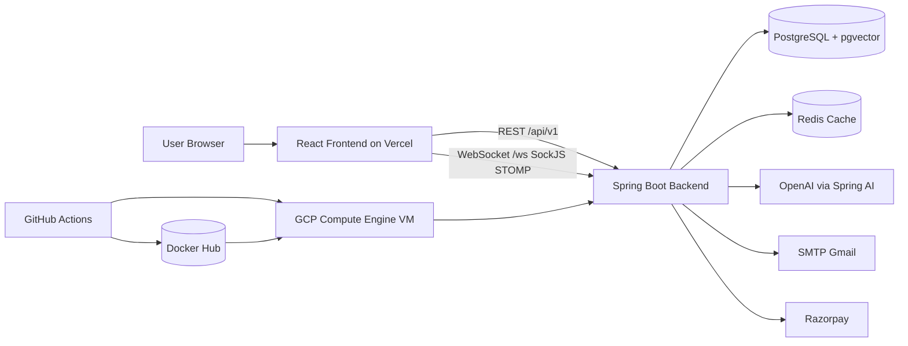
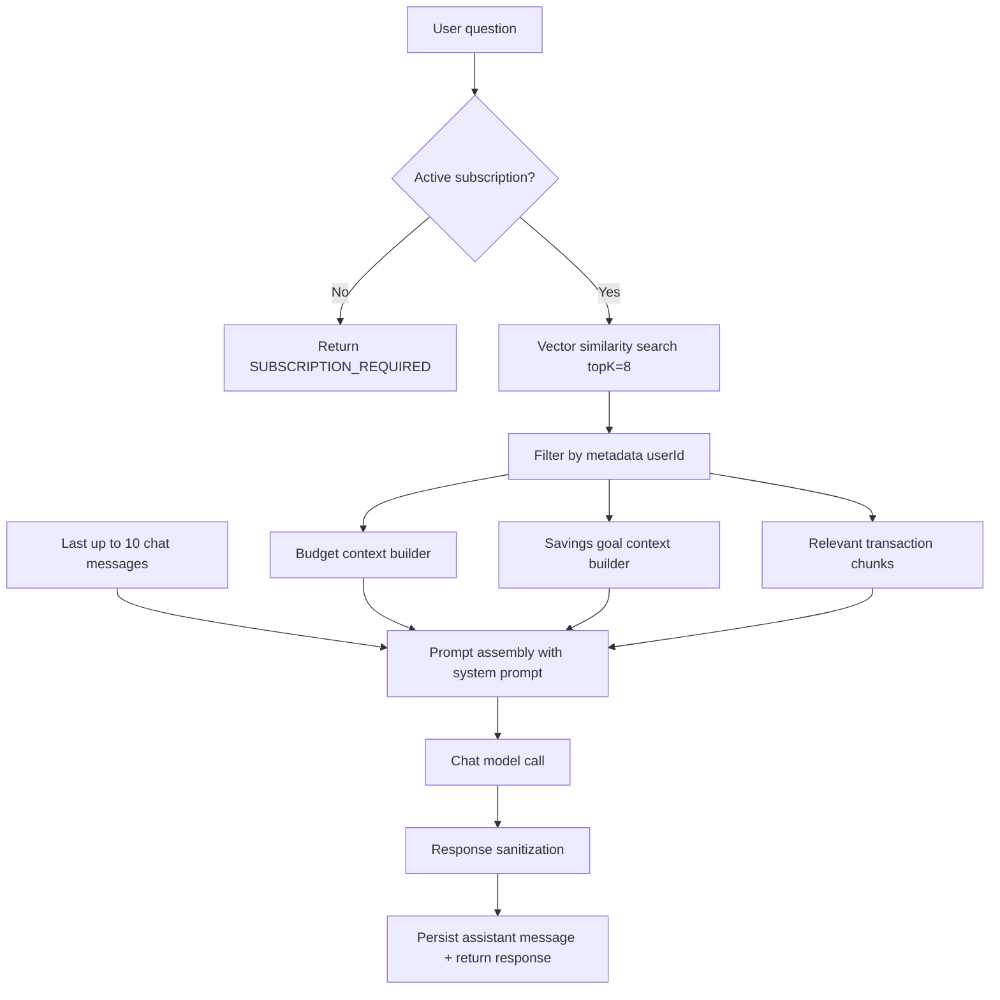

# WalletIQ 💰

<div align="center">

**A production-grade, RAG-powered personal finance system built with Spring Boot and React.**

Track expenses, set budgets, manage savings goals, and get AI-driven financial insights through a natural language chat assistant — all grounded in your real transaction data.

[](https://www.walletiq.online)
[](http://localhost:8080/api/v1/swagger-ui.html)
[](LICENSE)
[](https://openjdk.org/projects/jdk/21/)
[](https://spring.io/projects/spring-boot)
[](https://react.dev)

</div>

---

## 1. Project Purpose

This project is designed as a senior-level full-stack portfolio system with:

- Enterprise-style backend architecture (layered services, validation, exception handling, schedulers, security, observability)
- Modern frontend architecture (feature modules, typed API layer, route guards, state + server-cache separation)
- Production deployment practices (Docker, CI/CD, cloud VM rollout)
- Applied AI engineering (RAG pipeline over user-scoped financial data)

## 2. Core Business Features

- JWT authentication with refresh-token flow and role-based access (`USER`, `ADMIN`)
- Transaction tracking (income/expense), filtering, pagination, CSV export
- Category and payment mode management (defaults + custom)
- Monthly budgets with threshold and limit breach tracking
- Savings goals with contribution workflow and automatic status transitions
- Recurring transactions with forecast engine (1 to 365 days)
- Real-time notifications (REST + WebSocket STOMP/SockJS)
- Dashboard analytics (summary, category breakdown, trends, top expenses)
- Subscription workflow (Razorpay order + signature verification)
- AI chat assistant powered by RAG over user transactions, budget, goals, and recent chat context

## 3. Tech Stack (with Versions and Selection Rationale)

### 3.1 Backend

| Area            | Stack                        |                               Version | Why this was chosen                                              |
| --------------- | ---------------------------- | ------------------------------------: | ---------------------------------------------------------------- |
| Language        | Java                         |                                    21 | LTS performance, records/sealed types, mature ecosystem          |
| Framework       | Spring Boot                  |                                3.5.11 | Production-ready web/security/data/scheduling stack              |
| Security        | Spring Security + JWT (JJWT) | Spring Security via Boot, JJWT 0.12.6 | Stateless auth, token-based API security, rotation support       |
| API Docs        | SpringDoc OpenAPI            |                                2.8.14 | Auto-generated contract docs for interview/demo usage            |
| DB              | PostgreSQL                   |                   16 (pgvector image) | Reliable relational store + SQL analytics                        |
| ORM             | Spring Data JPA / Hibernate  |                          Boot-managed | Clean repository + domain mapping model                          |
| Migrations      | Flyway                       |                          Boot-managed | Versioned schema migration for reproducible environments         |
| Cache           | Redis                        |                            7.2-alpine | Low-latency caching for dashboard and static-ish data            |
| AI Integration  | Spring AI                    |                                 1.1.2 | Unified LLM + embedding + vector-store abstraction               |
| Vector Store    | PgVector                     |                 via Spring AI starter | Native vector similarity search near transactional data          |
| Mail            | Spring Mail + Thymeleaf      |                          Boot-managed | Templated transactional emails                                   |
| CSV             | Apache Commons CSV           |                                1.10.0 | Stable CSV generation with encoding control                      |
| Payments        | Razorpay Java SDK            |                                 1.4.8 | Indian payment gateway integration for subscription monetization |
| Container Build | Google Jib Maven Plugin      |                                 3.4.2 | Daemonless, reproducible image builds in CI                      |

### 3.2 Frontend

| Area             | Stack                | Version | Why this was chosen                               |
| ---------------- | -------------------- | ------: | ------------------------------------------------- |
| Framework        | React                |  19.2.4 | Component model + ecosystem maturity              |
| Language         | TypeScript           |   5.9.3 | Strong typing for API/domain correctness          |
| Router           | React Router DOM     |  7.13.1 | Declarative route layout and guards               |
| Server State     | TanStack React Query | 5.90.21 | Fetch lifecycle, cache, retries, invalidation     |
| Client State     | Zustand              |  5.0.12 | Lightweight auth/session state management         |
| HTTP             | Axios                |  1.13.6 | Interceptors for JWT injection and silent refresh |
| Charts           | Recharts             |   3.8.0 | Dashboard visualizations                          |
| Motion           | Framer Motion        | 12.38.0 | UX polish and transitions                         |
| UI Notifications | Sonner               |   2.0.7 | Simple toast system                               |
| Styling          | Tailwind CSS         |   3.4.3 | Utility-first, scalable UI implementation         |
| Build Tool       | Vite                 |   8.0.0 | Fast local dev + optimized production bundles     |

### 3.3 Infra / DevOps

| Area                      | Stack                       | Why this was chosen                                                  |
| ------------------------- | --------------------------- | -------------------------------------------------------------------- |
| Local Orchestration       | Docker Compose              | Quick reproducible local infra (Postgres + Redis + optional backend) |
| Backend Container Runtime | Docker                      | Standard deployment artifact/runtime                                 |
| CI/CD                     | GitHub Actions              | Automated build/push/deploy on `main`                                |
| Registry                  | Docker Hub                  | Central image distribution for VM pull deployments                   |
| Cloud VM                  | Google Compute Engine (GCP) | Direct control of runtime host and Docker operations                 |
| Frontend Hosting          | Vercel                      | Fast static hosting + easy React deployment                          |
| Production DB             | Neon PostgreSQL             | Managed Postgres with SSL and developer-friendly workflow            |
| Production Redis          | Upstash Redis               | Managed Redis with TLS URL support                                   |

## 4. High-Level Architecture



## 5. RAG Pipeline (AI Chat)

### 5.1 What the implementation does

- Every user question is processed inside a chat session.
- System checks active subscription before AI access.
- Semantic retrieval is done from vector store with user-level filter.
- Additional financial context is assembled from budgets and goals.
- Recent chat history is included (last 10 messages).
- LLM response is sanitized before returning to UI.

### 5.2 RAG flow diagram



### 5.3 Prompting model in code

- System prompt file: `backend/src/main/resources/prompts/walletiq-system-prompt.txt`
- Retrieval config in service: `TOP_K = 8`, `MAX_HISTORY = 10`
- Filter expression: `userId == '<currentUserId>'`

## 6. CI/CD Pipeline (Backend)

### 6.1 Implemented workflow

File: `.github/workflows/deploy.yaml`

- Trigger: push to `main` (only when backend/workflow files change) or manual dispatch
- Build: Maven package + Jib image build
- Push: Docker Hub image `walletiq-backend:latest`
- Deploy: SSH into GCP VM and run pull + compose restart

### 6.2 CI/CD diagram

```mermaid
flowchart LR
  A[Push to main] --> B[GitHub Actions]
  B --> C[Setup JDK 21 + Maven cache]
  C --> D[mvn clean package jib:build -DskipTests]
  D --> E[Push image to Docker Hub]
  E --> F[SSH to GCP Compute Engine VM]
  F --> G[docker pull latest image]
  G --> H[docker-compose down --remove-orphans]
  H --> I[docker-compose up -d]
  I --> J[docker image prune -f]
```



## 7. Repository Structure

## 7.1 Top-level

```text
wallet-iq/
├── backend/                    # Spring Boot backend
├── frontend/                   # React + TypeScript frontend
├── docker/                     # Docker compose setups (local/prod/combined)
├── public/                     # diagrams, docs, screenshots assets
├── .github/workflows/          # CI/CD pipeline definitions
├── README.md
└── SCREENSHOTS.md
```

### 7.2 Backend (`backend/`)

```text
backend/
├── pom.xml
├── src/main/java/online/walletiq/
│   ├── controller/             # REST APIs
│   ├── service/ + service/impl # business logic
│   ├── repository/             # persistence access
│   ├── entity/                 # JPA domain models
│   ├── dto/                    # request/response contracts
│   ├── config/                 # security, mail, ai, redis, websocket, openapi
│   ├── security/               # JWT filters/services/handlers
│   ├── schedular/              # cron jobs
│   ├── mapper/                 # entity-dto mappers
│   ├── exception/              # domain exceptions + global handler
│   └── util/                   # helpers (response, security, cache, etc.)
└── src/main/resources/
    ├── application*.yml
    ├── db/migration/           # Flyway SQL migrations
    ├── prompts/                # AI system prompts
    ├── templates/mail/         # email templates
    └── keys/                   # RSA key resources
```

### 7.3 Frontend (`frontend/`)

```text
frontend/
├── package.json
├── src/
│   ├── features/
│   │   ├── auth/ dashboard/ transactions/ recurring/
│   │   ├── budgets/ savings/ categories/ payment-modes/
│   │   ├── chat/ notifications/ profile/ subscription/
│   │   └── admin/ about/ home/
│   ├── lib/axios.ts            # HTTP client + token refresh queue
│   ├── store/authStore.ts      # persisted auth state
│   ├── routes/                 # route constants + route tree
│   ├── shared/                 # reusable UI/hooks/utils
│   └── types/                  # generic API wrapper/error types
└── vercel.json
```

### 7.4 Docker & deployment files

```text
docker/
└── docker-compose/
    ├── local/                  # Postgres + Redis for local IDE backend runs
    ├── compose/                # full local stack compose (db+redis+backend)
    └── prod/                   # production backend container compose
```

## 8. Backend API Reference

Base URL (local): `http://localhost:8080/api/v1`

Swagger (non-prod):

- UI: `/api/v1/swagger-ui.html`
- OpenAPI JSON: `/api/v1/api-docs`

All protected APIs require:

- Header: `Authorization: Bearer <access_token>`

### 8.1 Authentication APIs

#### `POST /auth/signup`

- Description: Register a user.
- Request body:

```json
{
  "fullName": "Ripan Baidya",
  "email": "ripan@gmail.com",
  "password": "MySecure123"
}
```

#### `POST /auth/login`

- Description: Login and issue access + refresh tokens.
- Request body:

```json
{
  "email": "ripanbaidya@gmail.com",
  "password": "MySecurePassword123!"
}
```

#### `POST /auth/logout`

- Description: Revoke refresh token.
- Request body:

```json
{
  "refreshToken": "<refresh_token>"
}
```

#### `POST /auth/refresh-token`

- Description: Rotate refresh token and issue new token pair.
- Request body:

```json
{
  "refreshToken": "<refresh_token>"
}
```

#### `POST /auth/password-hash`

- Description: Utility endpoint for hashing passwords.
- Request body:

```json
{
  "password": "MySecurePassword123!"
}
```

#### `POST /auth/email/send-otp`

- Description: Send 6-digit OTP for email verification.
- Request body:

```json
{
  "email": "ripan@gmail.com"
}
```

#### `POST /auth/email/verify-otp`

- Description: Verify OTP and mark email verified.
- Request body:

```json
{
  "email": "ripan@gmail.com",
  "otp": "123456"
}
```

### 8.2 User Profile APIs

#### `GET /users/me`

- Description: Get current user profile.
- Request body: none.

#### `PATCH /users/me`

- Description: Update profile name.
- Request body:

```json
{
  "fullName": "John Doe"
}
```

### 8.3 Transaction APIs

#### `GET /transactions`

- Description: Paginated filtered transactions.
- Query params: `type`, `categoryId`, `dateFrom`, `dateTo`, pageable params (`page`, `size`, `sort`).
- Request body: none.

#### `GET /transactions/{id}`

- Description: Fetch transaction by ID.
- Request body: none.

#### `POST /transactions`

- Description: Create transaction.
- Request body:

```json
{
  "amount": 1250.5,
  "type": "EXPENSE",
  "date": "2026-03-16",
  "note": "Dinner with friends",
  "categoryId": "9c5c0f4c-9a3d-4b22-9a11-8f8c9b0c1234",
  "paymentModeId": "2d9a93df-8d2e-4b32-9f7e-1d7c7a12c567"
}
```

#### `PUT /transactions/{id}`

- Description: Update transaction.
- Request body:

```json
{
  "amount": 950.75,
  "type": "EXPENSE",
  "date": "2026-03-16",
  "note": "Dinner updated",
  "categoryId": "9c5c0f4c-9a3d-4b22-9a11-8f8c9b0c1234",
  "paymentModeId": "7b1fce20-8e9a-4a45-9b73-3a2dfecb8a21"
}
```

#### `DELETE /transactions/{id}`

- Description: Delete transaction.
- Request body: none.

#### `GET /transactions/export/csv`

- Description: Export all transactions to UTF-8 CSV (with BOM for Excel compatibility).
- Request body: none.

### 8.4 Category APIs

#### `GET /categories?type=EXPENSE|INCOME`

- Description: Fetch categories by type.
- Request body: none.

#### `POST /categories`

- Description: Create category.
- Request body:

```json
{
  "name": "Food",
  "categoryType": "EXPENSE"
}
```

#### `PUT /categories/{id}`

- Description: Update category.
- Request body:

```json
{
  "name": "Groceries",
  "categoryType": "EXPENSE"
}
```

#### `DELETE /categories/{id}`

- Description: Delete category.
- Request body: none.

### 8.5 Payment Mode APIs

#### `GET /payment-modes`

- Description: Fetch payment modes.
- Request body: none.

#### `POST /payment-modes`

- Description: Create payment mode.
- Request body:

```json
{
  "name": "UPI"
}
```

#### `PUT /payment-modes/{id}`

- Description: Update payment mode.
- Request body:

```json
{
  "name": "Credit Card"
}
```

#### `DELETE /payment-modes/{id}`

- Description: Delete payment mode.
- Request body: none.

### 8.6 Budget APIs

#### `POST /budgets`

- Description: Create budget for category + month.
- Request body:

```json
{
  "categoryId": "b3c4d5e6-7f8a-4b2c-9d1e-0a2b3c4d5e6f",
  "month": "2026-04",
  "limitAmount": 5000,
  "alertThreshold": 80
}
```

#### `GET /budgets?month=YYYY-MM`

- Description: Fetch month budgets.
- Request body: none.

#### `GET /budgets/{id}/status`

- Description: Get spent/remaining/usage status for one budget.
- Request body: none.

### 8.7 Savings Goal APIs

#### `POST /goals`

- Description: Create savings goal.
- Request body:

```json
{
  "title": "Buy MacBook Pro",
  "targetAmount": 150000,
  "deadline": "2026-12-31",
  "note": "Saving monthly"
}
```

#### `GET /goals`

- Description: List all goals.
- Request body: none.

#### `PATCH /goals/{id}/contribute`

- Description: Contribute to goal.
- Request body:

```json
{
  "amount": 500
}
```

#### `GET /goals/{id}/progress`

- Description: Goal progress details.
- Request body: none.

### 8.8 Recurring Transaction APIs

#### `POST /recurring`

- Description: Create recurring rule.
- Request body:

```json
{
  "title": "Wifi Bill",
  "amount": 500,
  "type": "EXPENSE",
  "frequency": "MONTHLY",
  "startDate": "2026-04-01",
  "endDate": "2027-04-01",
  "note": "Monthly wifi bill",
  "categoryId": "c7d8e9f1-6b2a-4c5d-8f3e-2a1b0c9d8e7f",
  "paymentModeId": "b3c4d5e6-7f8a-4b2c-9d1e-0a2b3c4d5e6f"
}
```

#### `GET /recurring`

- Description: List active recurring transactions.
- Request body: none.

#### `GET /recurring/{id}`

- Description: Get recurring transaction by ID.
- Request body: none.

#### `PATCH /recurring/{id}`

- Description: Partial update recurring transaction.
- Request body:

```json
{
  "title": "Updated Wifi Bill",
  "amount": 650,
  "frequency": "MONTHLY",
  "endDate": "2027-05-01",
  "note": "Updated note",
  "categoryId": "c7d8e9f1-6b2a-4c5d-8f3e-2a1b0c9d8e7f",
  "paymentModeId": "b3c4d5e6-7f8a-4b2c-9d1e-0a2b3c4d5e6f"
}
```

#### `DELETE /recurring/{id}`

- Description: Deactivate recurring transaction.
- Request body: none.

#### `GET /recurring/forecast?days=30`

- Description: Forecast recurring cashflow for 1 to 365 days.
- Request body: none.

### 8.9 Dashboard APIs

#### `GET /dashboard?month=YYYY-MM`

- Description: Dashboard analytics for selected/current month.
- Request body: none.

### 8.10 Notifications APIs

#### `GET /notifications`

- Description: List user notifications.
- Request body: none.

#### `DELETE /notifications/{id}`

- Description: Delete one notification.
- Request body: none.

#### `DELETE /notifications`

- Description: Delete all notifications for current user.
- Request body: none.

### 8.11 Chat APIs (RAG)

#### `GET /chat/sessions`

- Description: Fetch all chat sessions.
- Request body: none.

#### `POST /chat/sessions`

- Description: Create chat session.
- Request body:

```json
{
  "title": "New Chat"
}
```

#### `DELETE /chat/sessions/{id}`

- Description: Delete session + messages.
- Request body: none.

#### `GET /chat/sessions/{id}/messages`

- Description: Fetch ordered session messages.
- Request body: none.

#### `POST /chat/sessions/{id}/query`

- Description: Ask AI assistant inside session.
- Request body:

```json
{
  "question": "How much did I spend on food this month?"
}
```

### 8.12 Subscription APIs

#### `POST /subscriptions/order`

- Description: Create Razorpay order for subscription.
- Request body: none.

#### `POST /subscriptions/verify`

- Description: Verify Razorpay signature and activate subscription.
- Request body:

```json
{
  "razorpayOrderId": "order_Ma8J9x7k2YpQz1",
  "razorpayPaymentId": "pay_Ma8K3l9ZxYpQw2",
  "razorpaySignature": "<signature>"
}
```

#### `GET /subscriptions/status`

- Description: Get current subscription state/expiry.
- Request body: none.

### 8.13 Admin APIs (ADMIN role)

#### `GET /admin/users?page=0&size=10`

- Description: Paginated user list.
- Request body: none.

#### `GET /admin/users/{id}`

- Description: Get user by ID.
- Request body: none.

#### `GET /admin/users/count?role=USER&active=true`

- Description: Count users by role and active status.
- Request body: none.

### 8.14 App Info APIs

#### `GET /app/info`

- Description: Application metadata for About page.
- Request body: none.

## 9. WebSocket Notifications

- Endpoint: `/api/v1/ws` (SockJS)
- Broker topic format: `/topic/notifications/{userId}`
- Use case: push budget alerts, recurring execution notices, savings goal updates

## 10. Schedulers and Background Jobs

- Recurring execution scheduler: daily at `08:00` server time
- Goal expiry scheduler: daily at `00:30`
- Refresh token cleanup scheduler: daily at `02:00`
- Daily summary mail scheduler exists but cron annotation is currently commented out

## 11. Environment Configuration

### 11.1 Backend profiles

- `dev`: local DB/Redis and OpenAI model settings
- `docker`: container-network DB/Redis profile
- `prod`: managed services (Neon/Upstash), hardened logs, actuator-safe exposure

### 11.2 Key environment variables

```bash
# AI
OPENAI_API_KEY=
OPENAI_CHAT_MODEL=gpt-4o-mini
OPENAI_EMBEDDING_MODEL=text-embedding-3-small
PGVECTOR_DIMENSIONS=1536

# Mail
MAIL_USERNAME=
MAIL_PASSWORD=
MAIL_SSL_TRUST=smtp.gmail.com

# Razorpay
RAZORPAY_KEY_ID=
RAZORPAY_KEY_SECRET=
SUBSCRIPTION_AMOUNT=19900
SUBSCRIPTION_DAYS=30

# Production DB
DB_HOST=
DB_PORT=
DB_NAME=
DB_USERNAME=
DB_PASSWORD=

# Redis
REDIS_URL=
REDIS_SSL_ENABLED=true

# CORS
CORS_ORIGIN_LOCAL=
CORS_ORIGIN_VERCEL=
CORS_ORIGIN_PRIMARY=

# JWT expiry
JWT_ACCESS_TOKEN_EXPIRY=3600000
JWT_REFRESH_TOKEN_EXPIRY=604800000
```

## 12. Local Development Setup

### 12.1 Prerequisites

- Java 21
- Maven 3.9+
- Node.js 20+
- Docker Desktop

### 12.2 Run local infra

```bash
cd /Users/ripanbaidya/Documents/projects/wallet-iq/docker/docker-compose/local
docker compose up -d
```

### 12.3 Run backend

```bash
cd /Users/ripanbaidya/Documents/projects/wallet-iq/backend
./mvnw spring-boot:run
```

Backend URL: `http://localhost:8080/api/v1`

### 12.4 Run frontend

```bash
cd /Users/ripanbaidya/Documents/projects/wallet-iq/frontend
npm install
npm run dev
```

Frontend URL: `http://localhost:5173`

## 13. Deployment (GCP + Docker)

### 13.1 Backend runtime model

- GCP Compute Engine VM hosts Docker runtime
- Workflow SSHs into VM path `/opt/walletiq`
- VM pulls latest Docker image and restarts compose services

### 13.2 Production compose file

- File: `docker/docker-compose/prod/docker-compose.yaml`
- Runtime env from `.env`
- Backend healthcheck: `/api/v1/actuator/health`

## 14. Database and Migration

- Schema migrations: `backend/src/main/resources/db/migration/`
  - `V1__init_schema.sql`
  - `V2__insert_default_category_and_payment_mode.sql`
  - `V3__create_system_admin.sql`

## 15. Engineering Standards Already Applied

- Domain-specific exception classes + global exception handler
- DTO-level validation (`jakarta.validation`) with clear constraints
- Stateless security with JWT filter chain and role authorization
- Reusable response envelope pattern (`ResponseWrapper`)
- Cache key generation strategy for expensive query shapes
- Service layer ownership checks to prevent cross-user data access
- OpenAPI annotations for maintainable API contracts
- Scheduler responsibilities separated from service logic

## 17. Useful Links

- Live Link: [https://www.walletiq.online](https://www.walletiq.online)
- Github Repository: [https://github.com/ripanbaidya/wallet-iq](https://github.com/ripanbaidya/wallet-iq)

## 18. License

This repository includes `LICENSE` at root.
